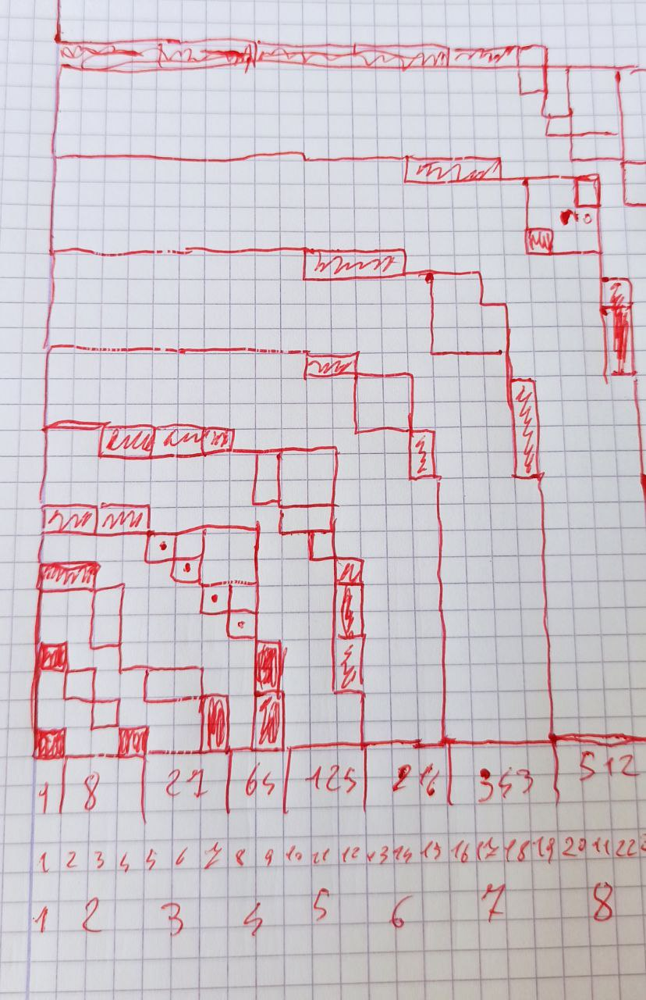
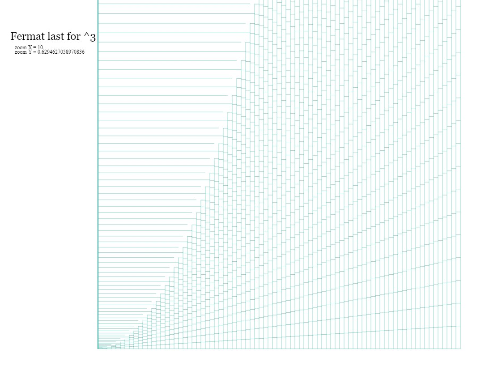

# Fermat Last Theorem debunked
#### very short explanation  
powers of number are just like natural numbers, (period)  
(as if they had been written in the form n1)  

in natural numbers, you can sum any of them to produce any other, (of course)    
just because in the domain of the power of 1 , leaves all gaps equal to 0  
  
in the domain of power of two,  you are summing squares which leaves behind gaps of 3,5,7,9 ...  
in the domain of power of three,  you are summing cubes which leaves behind gaps of 7,19,37,61 ...  
and so forth ..  
( while for any power and stepting from 0 is always 1 )  

## point is .. 
##### it's a geometrical progression so it's proven just like for prime numbers 
the initial pattern,  will just repeat itself over n over again ..
##   

## An &ne; Bn + Cn  
... 

### A2 &ne; B2 + C2  
####  52 - ( 42 + 32 ) = 0  
so,,  
####  (&gamma;5)2 - ( (&gamma;4)2 + (&gamma;3)2 ) = 0  
and so ..  
####  (&gamma;9)2 - ( (&gamma;8)2 + (&gamma;4)2 ) = 1
then ..  
####  (&gamma;9)2 - ( (&gamma;8)2 + (&gamma;4)2 + (&gamma;1)2 ) = 0
...  
  
### A3 &ne; B3 + C3  
####  93 - ( 83 + 63 ) = 1  
so,,  
####  (&gamma;9)3 - ( (&gamma;8)8 + (&gamma;6)3 ) = (&gamma;3)1  
then ..  
####  (&gamma;9)3 - ( (&gamma;8)8 + (&gamma;6)3 + (&gamma;1)31 ) =  0 
...   

### A4 &ne; B4 + C4  
####  94 - ( 84 + 74 ) = 64  
so,,  
####  (&gamma;9)4 - ( (&gamma;8)4 + (&gamma;7)4 ) = (&gamma;4)64  
####  (&gamma;13)4 - ( (&gamma;12)4 + (&gamma;8)4 ) + (&gamma;7)4 ) + (&gamma;6)4 ) = (&gamma;4)32  
...  
  
## A1 &ne; B1 + C1  
( prime numbers .. guess why .. )  

##### some possible reppresentations of cubes in 2D domain  
  
https://cloned2k16.github.io/Fermat/
